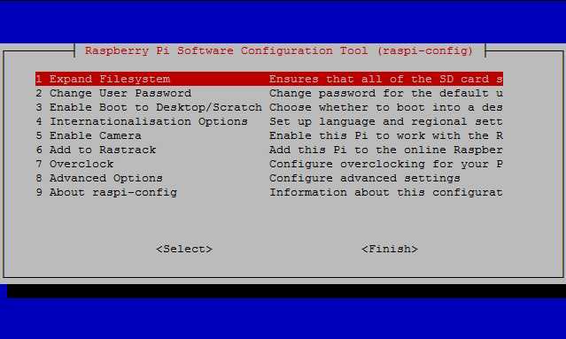

# Turtlebot Waffle Pi
## 라즈베리파이 환경 설정

### [라즈비안 베이스의 환경설정]

### SD card 인식 환경 구성
```bash
$ sudo raspi-config
(select 7 Advanced Options > A1 Expand Filesystem)
```
Select 7 [Adavenced Options]  


Select A1 Expand Filesystem  


### 시간 동기화
컴퓨터 시간과 실제 시간 동기화  
```bash
sudo apt-get install ntpdate
sudo ntpdate ntp.ubuntu.com
```
### ROS를 위한 네트워크 환경 구성
```bash
nano ~/.bashrc
(modify `localhost` to REMOTE_PC_IP and RASPBERRY_PI_3_IP)

export ROS_MASTER_URI=http://REMOTE_PC_IP:11311
export ROS_HOSTNAME=RASPBERRY_PI_3_IP
source ~/.bashrc
```
.bashrc 문서에 위의 2명령어 추가 후 저장

>MASTER_URI : ROS를 제어할 원격 제어 PC의 IP주소:11311  
ex) exort ROS_MASTER_URI=http://192.168.101.22:11311  

>ROS_HOSNAME : 현재 제어될 라즈베리파이 IP주소
ex) exort ROS_HOSTNAME=RASPBERRY_PI_3_IP

저장 후에는 source ~/.bashrc를 커맨드 창에 입력하거나 터미널을 재실행 하여 위의 설정을 갱신

